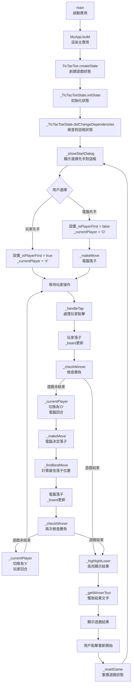

我可以幫您將 Mermaid 圖表轉換成流程圖。Mermaid 本身就是一種用於創建各種圖表(包括流程圖)的標記語言，所以您可能是想問如何將 Mermaid 語法轉換成其他格式的流程圖。以下是幾種方法：

使用 Mermaid Live Editor 導出圖片：

訪問 Mermaid Live Editor (https://mermaid.live/)
輸入您的 Mermaid 語法
使用導出功能將圖表保存為 PNG、SVG 或 PDF 格式

使用程式庫進行轉換：

可以使用 mermaid-cli (mmdc) 命令行工具將 Mermaid 圖表轉換成圖片
安裝: npm install -g @mermaid-js/mermaid-cli
使用: mmdc -i input.mmd -o output.png

整合到文檔工具：

許多工具如 VS Code、Notion、Obsidian 等都支持 Mermaid 語法
可以在這些工具中創建圖表後導出為其他格式

使用 API 或自定義腳本：

mermaid.js 庫提供 API 可以編程方式轉換圖表
可以寫腳本將 Mermaid 語法轉換為其他流程圖格式

如果您想將現有的 Mermaid 圖表轉換成另一種流程圖格式(如 Visio、Draw.io 等)，通常最簡單的方法是先導出為 SVG 或 PNG，然後在目標工具中重新創建或導入該圖像。
您有特定想要轉換到的流程圖格式嗎？我可以提供更具體的建議。

<think>好的，我要為這個井字遊戲創建一個使用Mermaid格式的畫面流程圖。我需要包含函式名，並且清楚地展示遊戲的流程。

首先，讓我分析一下整個遊戲的流程：

1. 應用啟動，執行`main()`函數
2. 創建`MyApp`，然後渲染`TicTacToe`
3. `TicTacToeState`被初始化，執行`initState()`
4. 執行`didChangeDependencies()`，這會觸發`_showStartDialog()`讓用戶選擇誰先下
5. 根據用戶選擇，設置`_isPlayerFirst`值，如果電腦先下，調用`_makeMove()`
6. 用戶與電腦交替落子，每次落子都會檢查勝負
   - 用戶點擊棋盤，觸發`_handleTap()`
   - 處理用戶落子，檢查勝負
   - 如果遊戲未結束，電腦會通過`_makeMove()`落子
   - 電腦使用`_findBestMove()`決定落子位置
   - 落子後檢查勝負
7. 一旦產生勝負，顯示結果並高亮顯示獲勝者
8. 用戶可以點擊「重新開始」按鈕，觸發`_resetGame()`，回到選擇先手的對話框

現在，我將這個流程轉換為Mermaid流程圖。Mermaid支持多種圖表類型，對於這種情況，我覺得一個流程圖(flowchart)最適合展示這個遊戲的流程：</think># 井字遊戲畫面流程圖

## 流程說明

1. **初始化階段**
   - 應用啟動，從`main()`到`initState()`
   - `didChangeDependencies()`檢查並顯示選擇先手對話框
   
2. **遊戲開始階段**
   - 用戶選擇先手，設置初始狀態
   - 如果電腦先手，立即執行`_makeMove()`
   
3. **遊戲交互階段**
   - 玩家通過`_handleTap()`落子
   - 電腦通過`_makeMove()`和`_findBestMove()`決策落子
   - 每次落子後使用`_checkWinner()`檢查勝負
   
4. **遊戲結束階段**
   - 有勝負結果時，`_highlightLoser()`高亮顯示
   - `_getWinnerText()`獲取並顯示結果文字
   
5. **重新開始**
   - 用戶點擊重新開始按鈕，`_resetGame()`重置遊戲
   - 回到選擇先手對話框，開始新一輪遊戲

這個流程圖清晰地展示了井字遊戲的完整生命週期和各個功能函數之間的調用關係。
